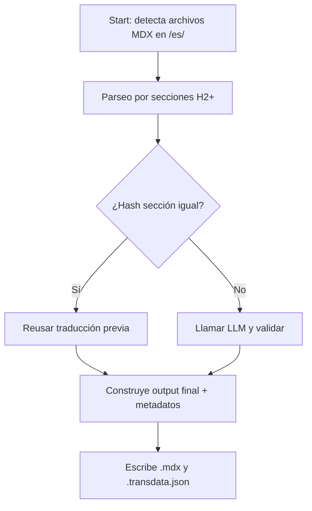

# Algoritmo y Control de Procesos

## Diagrama de flujo de decisión

## Secuencia por sección

1. Calcular hash SHA-256 de sección (excepto imports/JSX)
2. Si existe mismo hash en transdata.json del destino, reusar traducción
3. Si cambia:  
   - Traducir vía LLM, con hasta 3 intentos (verifica no truncado)
   - Postprocesar (enlaces, formato MDX)
   - Actualizar hash/metadata
4. Tags en frontmatter **no se traducen**, keywords sí
5. Generar o actualizar reporte JSON por corrida

---

## Robustecimiento

- Lógica anti-truncamiento: une hasta 3 respuestas en caso de límites
- Alerta ante errores del LLM/respuestas nulas
- Fallbacks: mantiene original si traducción falla tras 3 intentos

---