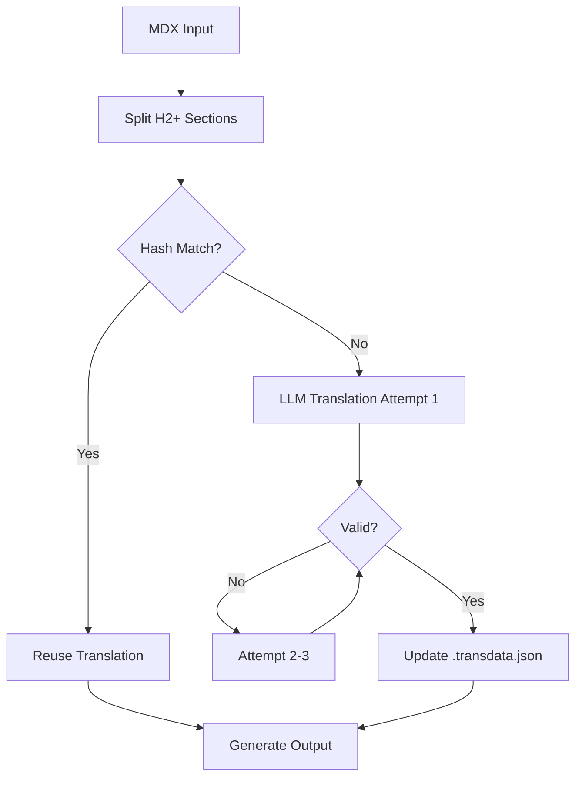

# Translation Algorithm



## Critical Checks
1. **Frontmatter Safety**  
   - Preserves original YAML structure
   - Only translates specific fields (title/description/keywords)

2. **Content Protection**  
   - Never translates code blocks (```) or JSX
   - Maintains original line endings (CRLF/LF)

3. **Hash Validation**  
   ```python
   # SHA-256 calculation logic
   hash = sha256(normalize_content(section_text))
   ```

4. - Sections starting with `import ` or `<` (JSX) are preserved as-is, never translated.
   ```

---


> ⚠️ **Failure Modes**: See [TROUBLESHOOT.md](TROUBLESHOOT.md#hash-errors)
```

---