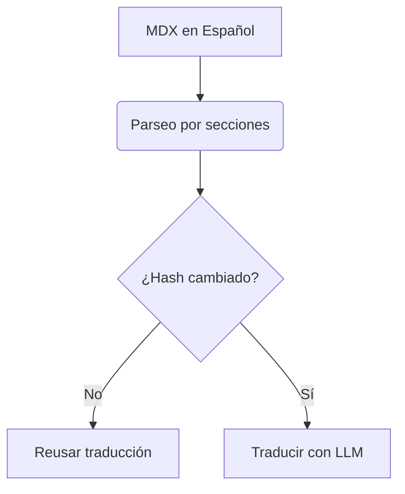

# Technical Specification

## Core Architecture

## Critical Paths
- **Glosarios**: `scripts/glossaries/[lang].yml`
- **Reglas**: `scripts/translation_rules.txt`
- **Reportes**: `scripts/reports/translate-report_*.json`

## Validation Layers
1. Hash SHA-256 de contenido
2. 3 reintentos por sección
3. Filtrado de respuestas truncadas
